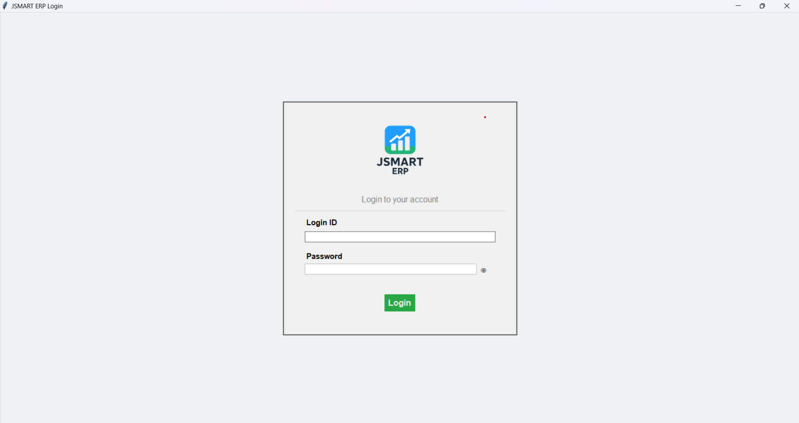
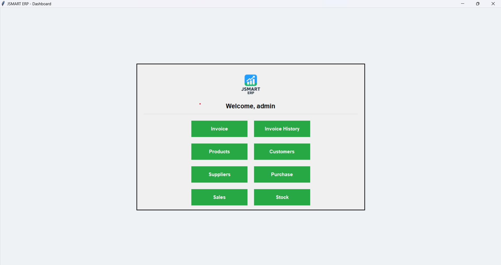
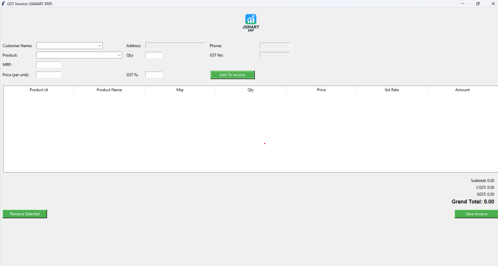
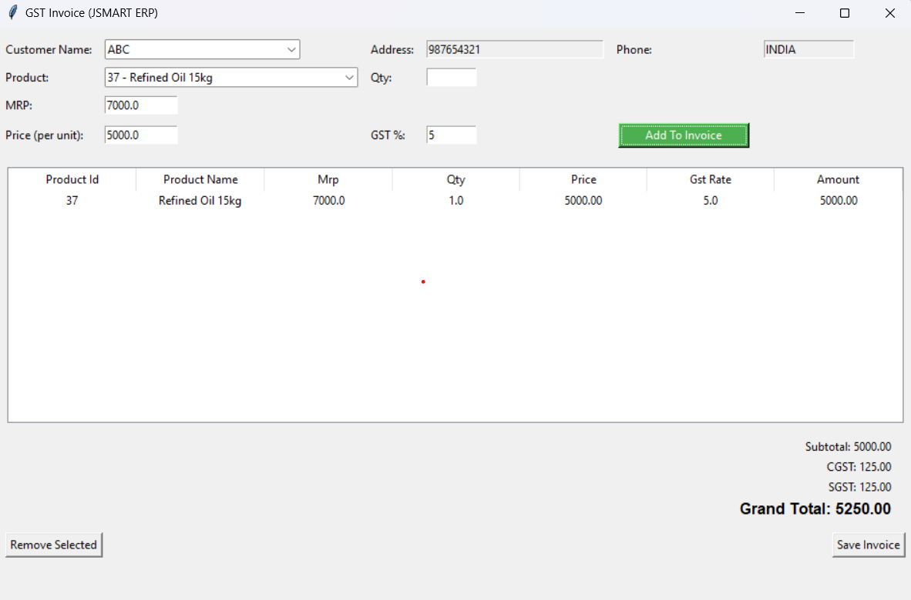
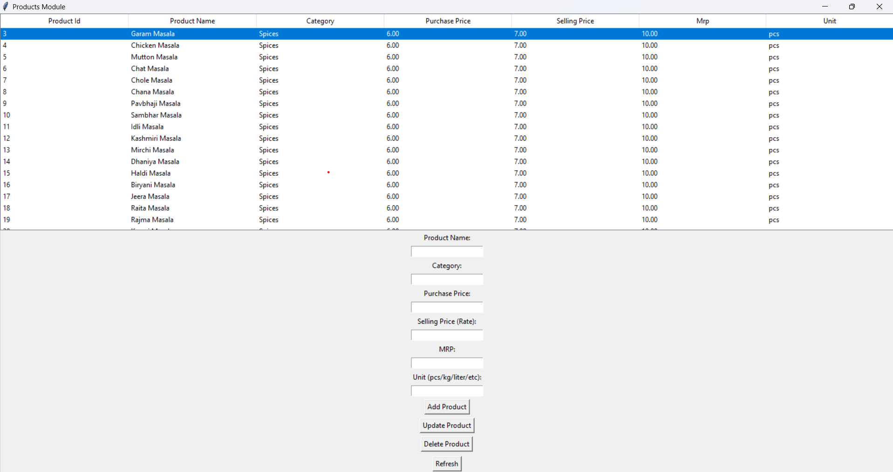
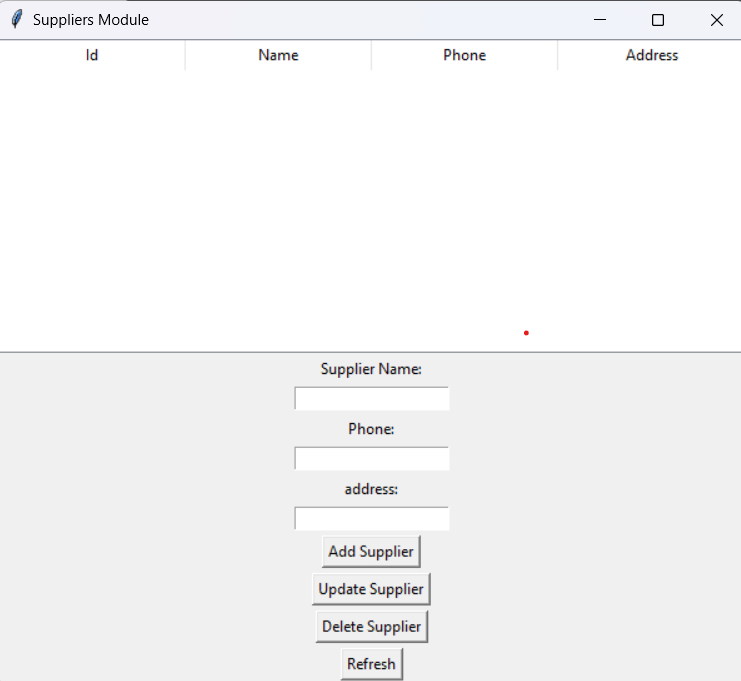

# 💼 JSMART ERP – GST Billing & Inventory Management System  

A desktop-based **ERP (Enterprise Resource Planning)** software built using **Python (Tkinter)** and **PostgreSQL**.  
This system helps manage **invoices, products, customers, suppliers, purchases, sales, and stock** for small & medium businesses.

---

# 🔵 Latest Update – (15 Nov 2025)

### ✔ Added Custom JSMART Logo  
New professional branding added on login, dashboard, and invoice screens.

### ✔ Updated UI Color Theme  
Applied a modern green-accent theme with a cleaner layout.

### ✔ New Updated Screens (Aaj ka Kaam)  
Added new updated UI designs including:  
- Updated Login Window  
- Updated Dashboard  
- Updated GST Invoice Billing Window  

(New screenshots added below 👇)

---

# 🚀 Features

✅ **User Authentication** – Secure login system  
✅ **Product Management** – Add / Update / Delete products  
✅ **Supplier Management** – Track supplier data + GST number  
✅ **Customer Management** – Auto-fill customer phone & GST  
✅ **GST Invoice Billing** – CGST / SGST auto calculation  
✅ **Purchase & Sales Records** – Track transactions  
✅ **Stock Management** – Auto-updated stock  
✅ **PostgreSQL Database** – Safe & secure  
✅ **Tkinter GUI** – Easy & modern interface  

---

# 🛠️ Tech Stack

| Component | Technology |
|----------|------------|
| **Frontend (GUI)** | Python Tkinter |
| **Backend** | Python |
| **Database** | PostgreSQL |
| **Connector** | psycopg2 |
| **Platform** | Windows |

---

# 📸 Screenshots (Updated)

### 🔐 Updated Login Window  


### 📊 Updated Dashboard  


### 🧾 Updated GST Invoice Billing  


---

# 📁 Old Screenshot Modules (Previous Version)

### 🧾 Old GST Invoice  


### 📦 Products Module  


### 🚚 Supplier Module  


---

# 🧩 Database Structure

**Tables Used:**
- users  
- products  
- customers  
- suppliers  
- purchase  
- sales  
- invoices  
- invoice_items  

---

# ▶️ How to Run

### 1. Install Libraries  
```bash
pip install psycopg2
pip install pillow
```

### 2. Configure PostgreSQL  
Update `db_connection.py`:

```python
def get_connection():
    return psycopg2.connect(
        host="localhost",
        database="jsmart_erp",
        user="postgres",
        password="your_password"
    )
```

### 3. Start the Software  
```bash
python login.py
```

---

# 👨‍💻 Developer  
**Developed by:** *Jitesh Sachdev*  
📩 **Contact:** 8959813899  

